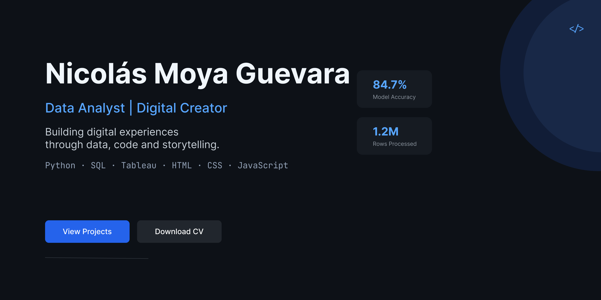

  

<h1 align="center">Hi, I'm Nicolás Moya Guevara 👋</h1>

<h3 align="center">
Data Analyst | Digital Creator
</h3>

Building digital experiences through data, code and storytelling.

---

# 👨‍💻 Who I Am

I believe technology is at its best when it helps people understand something they couldn't see before.

I'm currently building my career as a **Data Analyst**, combining analytical thinking, programming and communication to transform data into meaningful insights.

Before transitioning into tech, I spent years teaching languages, an experience that taught me one lesson I still apply every day:

> **Complex ideas don't have to be difficult to explain.**

Today I enjoy creating projects where data, software and storytelling come together to solve problems and communicate ideas clearly.

---

# 📊 Why Data Analytics?

What excites me about data analytics is not just working with numbers.

It's discovering patterns, asking better questions and helping people make informed decisions.

I enjoy the entire analytical process:

- Cleaning messy datasets.
- Exploring data to discover insights.
- Building visualizations.
- Turning technical results into clear business recommendations.

For me, data tells stories.
My job is to make those stories understandable.

---

# 🛠️ Tech Stack

### 📊 Data Analytics

### 🌐 Web Development

---

# 🚀 Currently Learning

I'm committed to continuous learning and documenting everything I build.

Currently expanding my skills in:

- 🤖 Machine Learning
- ⚛️ React
- ⚡ FastAPI
- 🐳 Docker
- 🎮 Unity
- 💻 C#
- ⚙️ C / C++
- 🎨 Pixel Art
- 📖 Data Storytelling

- ---

# 🚀 Featured Projects

## 📊 Data Analytics

### 🚦 Urban Mobility & Economic Productivity Analysis
**Python • Pandas • NumPy • Matplotlib • Jupyter**

Integrated traffic congestion and economic datasets from TomTom Traffic Index and OECD Cities to explore relationships between urban mobility, unemployment and GDP per capita.

🔗 Repository *(Coming Soon)*

---

### 💰 Financial Performance & ROI Analysis
**SQL • Business Analytics • KPI Analysis**

Analyzed revenue, costs, profit margins and ROI across international markets, transforming raw business data into actionable recommendations.

🔗 Repository *(Coming Soon)*

---

### 👥 User Funnel & Retention Analysis
**SQL • Cohort Analysis • Funnel Analysis**

Evaluated user conversion and retention through cohort analysis to identify opportunities for improving customer acquisition and loyalty.

🔗 Repository *(Coming Soon)*

---

### 📈 Walmart Executive Dashboard
**Google Sheets • Dashboards • KPI Design**

Built an interactive executive dashboard with dynamic KPIs and visualizations to support business decision-making.

🔗 Repository *(Coming Soon)*

---

# 🌐 Web Development

Although I'm currently focused on Data Analytics, I also enjoy building websites and digital experiences.

## 📰 Revista Oopart

A literary magazine website developed from scratch using HTML and CSS.

Besides developing the website, I also design and edit every issue of the magazine using Scribus.

🌐 Website: https://revista-oopart.vercel.app/

🔗 Repository:
https://github.com/nicsebm-bit/RevistaOopart

---

## 💼 Personal Portfolio

A portfolio website that will evolve together with my professional career.

🔗 Repository:
https://github.com/nicsebm-bit/portafolio

---

### Other Front-End Projects

- Yahoo Clone
- Google Clone
- Edu-Path
- Logi-Pro-X
- Responsive Coffee Shop
- Hero Responsive

---

# ✍️ Creative Work

Technology is only one part of who I am.

I've always been passionate about storytelling, literature and communication. Long before transitioning into Data Analytics, I was already creating projects that combined creativity, design and digital publishing.

## 📚 Revista Oopart

Co-founder, web developer and editorial designer of **Revista Oopart**, an independent digital literary magazine.

My responsibilities include:

- Designing every issue using Scribus.
- Developing and maintaining the website.
- Publishing each edition online.
- Supporting the editorial process.

Working on this project strengthened skills that are also essential in data analytics:

- Clear communication
- Information organization
- Attention to detail
- Digital publishing
- Project management

---

## 📖 Writing

Writing continues to be one of my biggest passions.

Current projects include:

- Published author in the anthology **Mapas para Extraviarse**.
- Short stories and essays published in **Revista Oopart**.
- Currently writing my first novel.

I believe that storytelling and data analysis have something in common:

Both transform information into something meaningful.

---

# 💡 My Philosophy

I enjoy learning in public.

Every project I publish represents a step in my professional journey.

My goal isn't simply to collect certificates or learn new technologies.

It's to become someone capable of solving real problems through:

- Data
- Software
- Communication
- Continuous learning

I believe curiosity is one of the most valuable skills in technology.

That's why you'll find this profile constantly evolving as I build new projects and document what I learn.

---

# 🎯 Current Goals

Over the next few months I'm focused on building a strong portfolio by completing real-world projects in Data Analytics and Software Development.

Current objectives:

- ✅ Complete the TripleTen Data Analytics Bootcamp.
- 🚀 Publish every analytics project with professional documentation.
- 🌐 Build a complete personal portfolio website.
- 📝 Create a Notion portfolio to document my learning journey.
- 🎮 Learn Unity and C# for game development.
- 🤖 Continue studying Machine Learning and Artificial Intelligence.
- 📚 Keep writing fiction and growing Revista Oopart.

- ---

# 🤝 Let's Connect

I'm always open to connecting with people interested in:

- Data Analytics
- Data Visualization
- Web Development
- Digital Products
- Creative Technology

📧 **Email**

**nicolassmoyag@gmail.com**

💼 **LinkedIn**

https://www.linkedin.com/in/nicolás-moya/

🌐 **Portfolio**

https://github.com/nicsebm-bit/portafolio

📚 **Revista Oopart**

https://revista-oopart.vercel.app/

---

> **"Always learning. Always building. Always sharing."**

